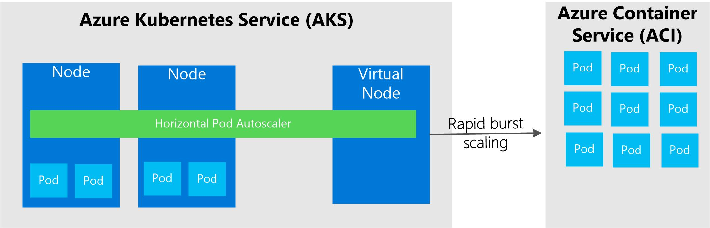
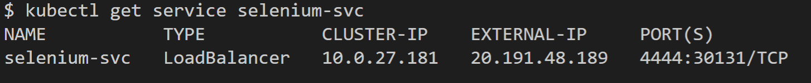
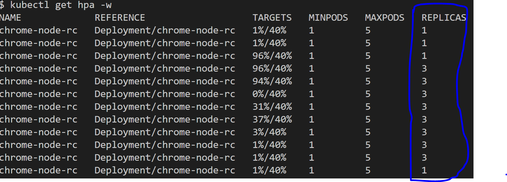

## Selenium Grid on Azure Kubernetes Services (AKS) with Horizontal Pod Autoscaler on virtual nodes (ACI).

This project, setup a Selenium Grid and Nodes (browsers) on AKS and Azure Container Instances (ACI) with autoscaling. 
With AKS virtual node, you have fast provisioning of selenium browser nodes pods and only pay per second, for their execution time. Horizontal Pod Autoscaler spin up new browser nodes depend on CPU usage.



## Prerequisites

Setup AKS with a virtual node (https://docs.microsoft.com/en-us/azure/aks/virtual-nodes-portal)

## Setup Selenium hub

```
kubectl apply -f hub-AKS-deployment.yaml
```

Create a service to access Selenum hub externally

```
kubectl apply -f hub-AKS-service.yaml
```

Run following to see service IP

```
kubectl get service selenium-svc
```




## Create Chrome node 

Please update HUB_HOST before running yaml file.

```
kubectl apply -f chrome-node-AKS-deployment.yaml
```

## Setup Pod Autoscaler

```
kubectl autoscale deployment chrome-node-rc --cpu-percent=40 --min=1 --max=5
```

```
kubectl get hpa -w
````



